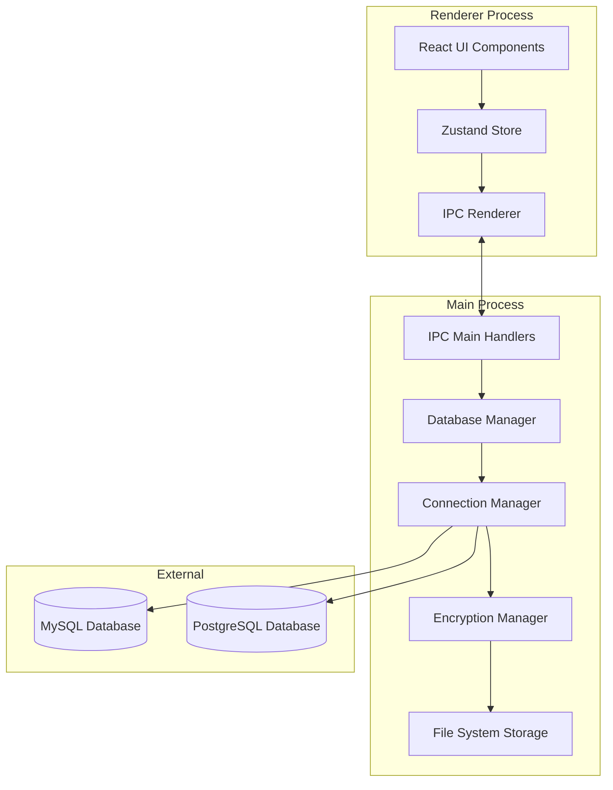
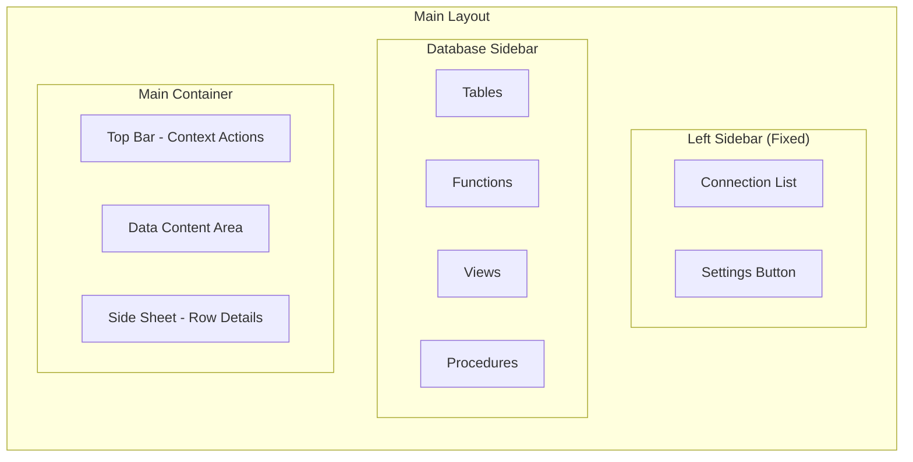

# Design Document

## Overview

Database Connection Manager, Electron uygulamasında MySQL ve PostgreSQL veritabanlarına güvenli bağlantı yönetimi sağlayan bir sistemdir. Sistem, IPC (Inter-Process Communication) tabanlı mimari kullanarak renderer process'te UI, main process'te database işlemlerini yönetir. Bağlantı bilgileri AES-256 şifreleme ile korunarak yerel dosya sisteminde saklanır.

## Architecture

### High-Level Architecture



### UI Layout Architecture



### Process Separation

- **Renderer Process**: UI bileşenleri, state management, kullanıcı etkileşimleri
- **Main Process**: Database bağlantıları, dosya sistemi işlemleri, şifreleme
- **Preload Script**: Güvenli IPC bridge

### Layout Flow

1. **Connection Selection**: Sol sidebar'da connection seçimi
2. **Database Object Loading**: Seçilen connection'ın database objeleri ikinci sidebar'da yüklenir
3. **Content Display**: Database object seçildiğinde main container'da ilgili veri gösterilir
4. **Context Actions**: Top bar'da seçilen object'e göre action butonları güncellenir
5. **Row Details**: Tablo satırı seçildiğinde side sheet açılır

## Components and Interfaces

### 1. Database Connection Types

```typescript
interface DatabaseConnection {
  id: string;
  name: string;
  type: 'mysql' | 'postgresql';
  host: string;
  port: number;
  database: string;
  username: string;
  password: string; // Encrypted in storage
  ssl?: boolean;
  createdAt: Date;
  updatedAt: Date;
}

interface ConnectionStatus {
  id: string;
  status: 'disconnected' | 'connecting' | 'connected' | 'error';
  error?: string;
  lastConnected?: Date;
}
```

### 2. IPC Interface

```typescript
interface DatabaseAPI {
  // Connection Management
  saveConnection(connection: Omit<DatabaseConnection, 'id'>): Promise<string>;
  updateConnection(id: string, connection: Partial<DatabaseConnection>): Promise<void>;
  deleteConnection(id: string): Promise<void>;
  getConnections(): Promise<DatabaseConnection[]>;
  
  // Database Operations
  connect(id: string): Promise<ConnectionStatus>;
  disconnect(id: string): Promise<void>;
  testConnection(connection: Omit<DatabaseConnection, 'id'>): Promise<boolean>;
  
  // Query Operations
  executeQuery(connectionId: string, sql: string, params?: any[]): Promise<QueryResult>;
  cancelQuery(connectionId: string): Promise<void>;
  getSchema(connectionId: string): Promise<DatabaseSchema>;
}
```

### 3. Main Process Components

#### Database Manager
```typescript
class DatabaseManager {
  private connections: Map<string, DatabaseAdapter>;
  private connectionStatuses: Map<string, ConnectionStatus>;
  
  async connect(connection: DatabaseConnection): Promise<void>;
  async disconnect(connectionId: string): Promise<void>;
  async executeQuery(connectionId: string, sql: string, params?: any[]): Promise<QueryResult>;
  async getSchema(connectionId: string): Promise<DatabaseSchema>;
}
```

#### Database Adapters
```typescript
abstract class DatabaseAdapter {
  protected connection: any;
  
  abstract connect(config: DatabaseConnection): Promise<void>;
  abstract disconnect(): Promise<void>;
  abstract executeQuery(sql: string, params?: any[]): Promise<QueryResult>;
  abstract getSchema(): Promise<DatabaseSchema>;
  abstract testConnection(): Promise<boolean>;
}

class MySQLAdapter extends DatabaseAdapter {
  // MySQL specific implementation using mysql2
}

class PostgreSQLAdapter extends DatabaseAdapter {
  // PostgreSQL specific implementation using pg
}
```

#### Encryption Manager
```typescript
class EncryptionManager {
  private key: Buffer;
  
  encrypt(text: string): string;
  decrypt(encryptedText: string): string;
  generateKey(): Buffer;
  loadOrCreateKey(): Buffer;
}
```

#### Storage Manager
```typescript
class StorageManager {
  private dataPath: string;
  private encryptionManager: EncryptionManager;
  
  async saveConnections(connections: DatabaseConnection[]): Promise<void>;
  async loadConnections(): Promise<DatabaseConnection[]>;
  async ensureDataDirectory(): Promise<void>;
}
```

### 4. Renderer Process Components

#### Connection Store (Zustand)
```typescript
interface ConnectionStore {
  connections: DatabaseConnection[];
  connectionStatuses: Map<string, ConnectionStatus>;
  activeConnection: string | null;
  
  // Actions
  loadConnections: () => Promise<void>;
  saveConnection: (connection: Omit<DatabaseConnection, 'id'>) => Promise<void>;
  updateConnection: (id: string, updates: Partial<DatabaseConnection>) => Promise<void>;
  deleteConnection: (id: string) => Promise<void>;
  connect: (id: string) => Promise<void>;
  disconnect: (id: string) => Promise<void>;
}

interface DatabaseStore {
  schema: DatabaseSchema | null;
  selectedTable: string | null;
  selectedObject: DatabaseObject | null;
  tableData: any[];
  selectedRow: any | null;
  
  // Actions
  loadSchema: (connectionId: string) => Promise<void>;
  selectTable: (tableName: string) => Promise<void>;
  selectObject: (object: DatabaseObject) => void;
  loadTableData: (tableName: string) => Promise<void>;
  selectRow: (row: any) => void;
}

interface UIStore {
  leftSidebarOpen: boolean;
  databaseSidebarOpen: boolean;
  rowDetailSheetOpen: boolean;
  
  // Actions
  toggleLeftSidebar: () => void;
  toggleDatabaseSidebar: () => void;
  toggleRowDetailSheet: () => void;
}
```

#### UI Components

##### Left Sidebar (Fixed)
- `ConnectionSidebar`: Ana bağlantı listesi (Discord server listesi gibi)
  - Icon-based connection items with tooltips
  - Add connection button (+)
  - Settings button (bottom)
- `ConnectionIcon`: Tek bağlantı ikonu (MySQL/PostgreSQL icons)
- `AddConnectionDialog`: Yeni bağlantı oluşturma modal

##### Database Sidebar (Dynamic)
- `DatabaseSidebar`: Seçili connection'ın database objelerini listeler
  - Tables, Views, Functions, Procedures
  - Collapsible sections
- `DatabaseObjectItem`: Tek database objesi (tablo, view vs.)
- `DatabaseObjectIcon`: Object type'a göre ikon

##### Main Container
- `TopBar`: Context-aware action bar
  - Connection name + database object name
  - Action buttons (Execute SQL, Add Row, Delete, etc.)
- `DataTable`: Tablo verileri görüntüleme
- `QueryEditor`: SQL sorgu editörü
- `ResultViewer`: Sorgu sonuçları
- `RowDetailSheet`: Seçili satır detayları (side sheet)

##### Shared Components
- `ConnectionForm`: Bağlantı oluşturma/düzenleme formu
- `ConfirmDialog`: Silme onayları için
- `LoadingSpinner`: Yükleme durumları
- `ErrorAlert`: Hata mesajları

## Data Models

### File System Structure
```
{app-data}/
├── data/
│   ├── connections.json (encrypted)
│   └── encryption.key
└── logs/
    └── database.log
```

### Database Schema Model
```typescript
interface DatabaseSchema {
  tables: TableInfo[];
  views: ViewInfo[];
  functions: FunctionInfo[];
  procedures: ProcedureInfo[];
}

interface DatabaseObject {
  name: string;
  type: 'table' | 'view' | 'function' | 'procedure';
  schema?: string;
}

interface TableInfo {
  name: string;
  columns: ColumnInfo[];
  indexes: IndexInfo[];
  foreignKeys: ForeignKeyInfo[];
  rowCount?: number;
}

interface ColumnInfo {
  name: string;
  type: string;
  nullable: boolean;
  defaultValue?: any;
  isPrimaryKey: boolean;
  isAutoIncrement: boolean;
}

interface ViewInfo {
  name: string;
  columns: ColumnInfo[];
  definition: string;
}

interface FunctionInfo {
  name: string;
  parameters: ParameterInfo[];
  returnType: string;
  definition: string;
}

interface ProcedureInfo {
  name: string;
  parameters: ParameterInfo[];
  definition: string;
}
```

### Query Result Model
```typescript
interface QueryResult {
  rows: any[];
  fields: FieldInfo[];
  rowCount: number;
  executionTime: number;
  affectedRows?: number;
}

interface FieldInfo {
  name: string;
  type: string;
  length?: number;
}
```

## Error Handling

### Error Types
```typescript
enum DatabaseErrorType {
  CONNECTION_FAILED = 'CONNECTION_FAILED',
  QUERY_ERROR = 'QUERY_ERROR',
  TIMEOUT = 'TIMEOUT',
  AUTHENTICATION_FAILED = 'AUTHENTICATION_FAILED',
  NETWORK_ERROR = 'NETWORK_ERROR',
  ENCRYPTION_ERROR = 'ENCRYPTION_ERROR',
  STORAGE_ERROR = 'STORAGE_ERROR'
}

interface DatabaseError {
  type: DatabaseErrorType;
  message: string;
  details?: any;
  connectionId?: string;
}
```

### Error Handling Strategy
- Main process'te tüm hatalar yakalanır ve structured error olarak renderer'a gönderilir
- UI'da user-friendly error mesajları gösterilir
- Critical hatalar log dosyasına yazılır
- Connection timeout'ları otomatik olarak handle edilir

## Testing Strategy

### Unit Tests
- Database adapters için mock database connections
- Encryption manager için test vectors
- Storage manager için temporary file system
- IPC handlers için mock electron APIs

### Integration Tests
- Real database connections ile end-to-end testler
- File system operations testleri
- IPC communication testleri

### Test Structure
```
tests/
├── unit/
│   ├── adapters/
│   ├── encryption/
│   └── storage/
├── integration/
│   ├── database/
│   └── ipc/
└── fixtures/
    ├── test-connections.json
    └── sample-schemas.json
```

## Security Considerations

### Encryption
- AES-256-GCM şifreleme algoritması
- Unique encryption key per installation
- Password'lar hiçbir zaman plain text olarak saklanmaz

### IPC Security
- Context isolation enabled
- Sandboxed renderer process
- Preload script ile controlled API exposure

### File System Security
- App data klasörü sadece uygulama tarafından erişilebilir
- Encryption key ayrı dosyada saklanır
- Log dosyalarında sensitive data bulunmaz

## Performance Considerations

### Connection Pooling
- Her connection type için ayrı pool
- Idle connection timeout
- Maximum connection limit

### Query Optimization
- Query result pagination
- Large result set streaming
- Query cancellation support

### Memory Management
- Connection cleanup on app exit
- Result set memory limits
- Garbage collection optimization

## Dependencies

### New Dependencies to Add
```json
{
  "mysql2": "^3.6.5",
  "pg": "^8.11.3",
  "crypto": "built-in"
}
```

### Dev Dependencies
```json
{
  "@types/pg": "^8.10.9"
}
```